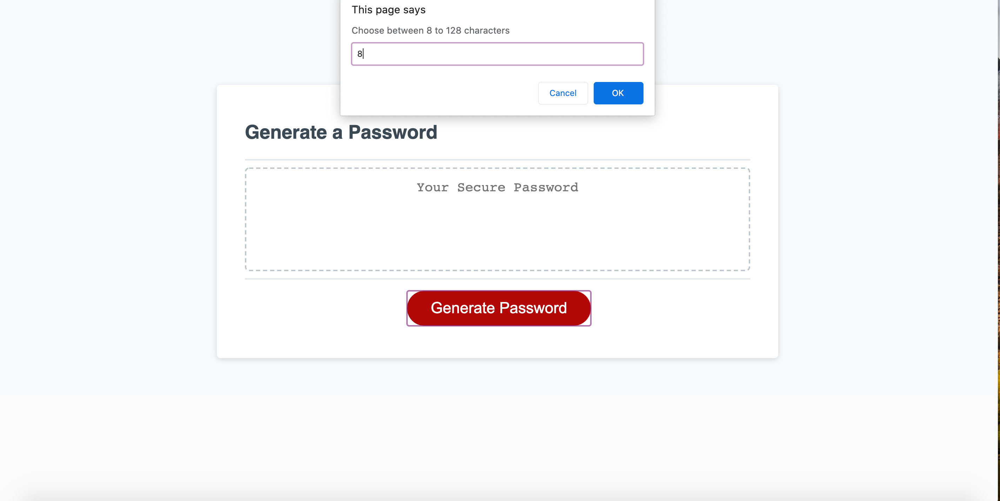

# guess-who

For this assignment we had to create a password generator using JavaScript. To get this started I needed to think about what questions we wanted to ask before putting everything together. These questions were asked via prompts and confirm pop ups on the webpage. Depending on the users input then it would generate their password. This was one assignment that I really had to use google a lot to help me understand more in-depth JavaScript and what to use to create this. 

#Installation

•	Created a git repository
•	Created three files (HTML, CSS, JS) were all created but it was the JS file that was mostly used and updated.
•	What I used to create the password generator from JavaScript:
o	Document Object Model (DOM)
o	Functions
o	Conditionals (If/Else statements)
o	Console logging
o	Strings and alerts

Creating a password generator is used every day with the many accounts that we need to create. This assignment was a challenge for me because of how complex JavaScript is for me. I struggled a lot on what would work best and what the next step needed to be. My tutor for the class helped me and explained in more detail why something worked or did not as well as my TA Melissa. Once I got an idea of how the concepts needed to be placed together then I was able to get through and complete the generator. 

#License

Used MIT License for this assignment. 

